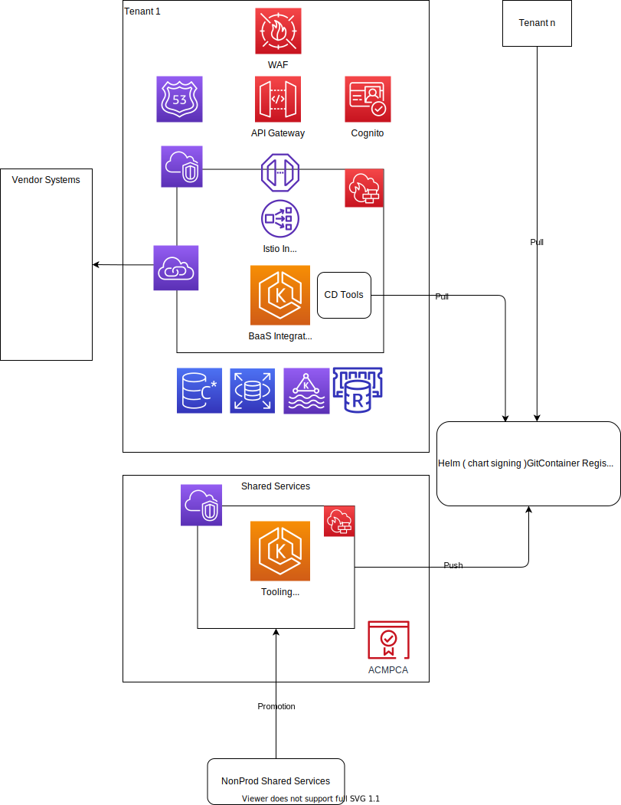
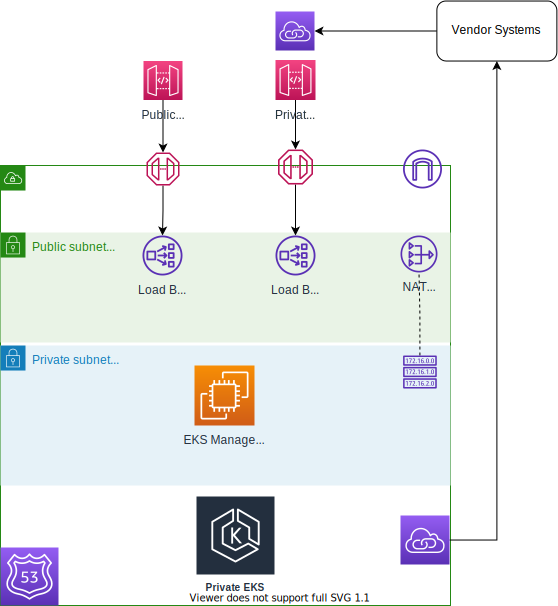
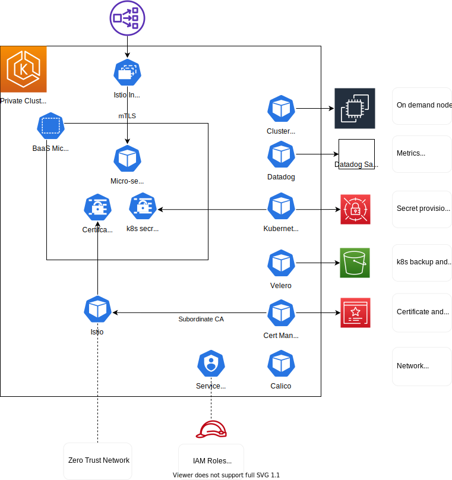
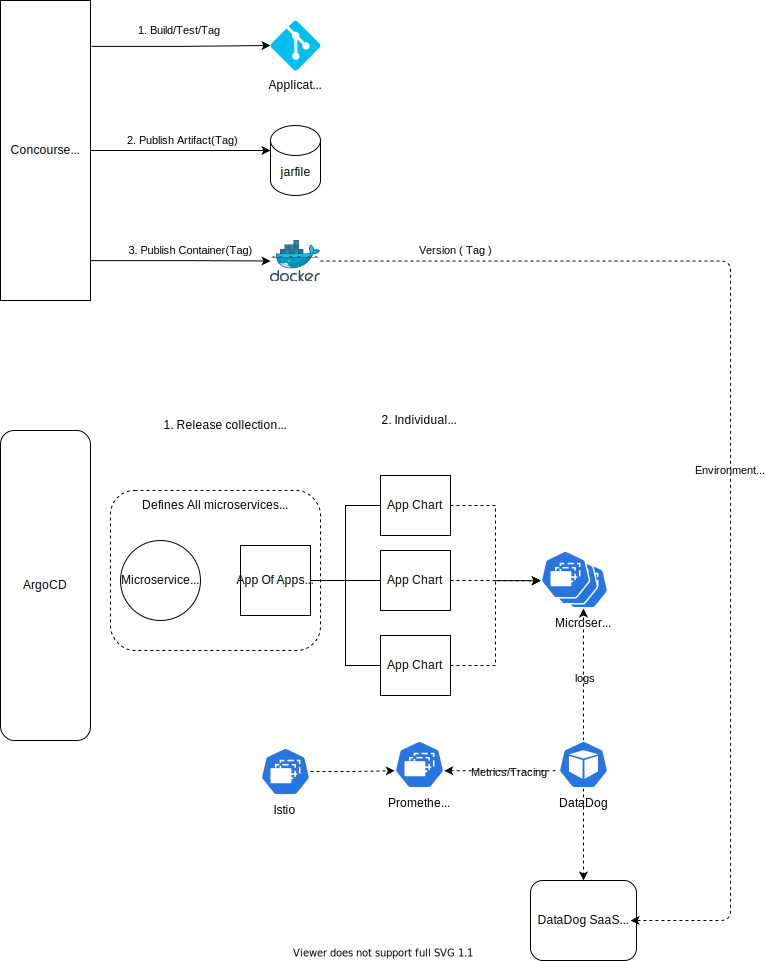
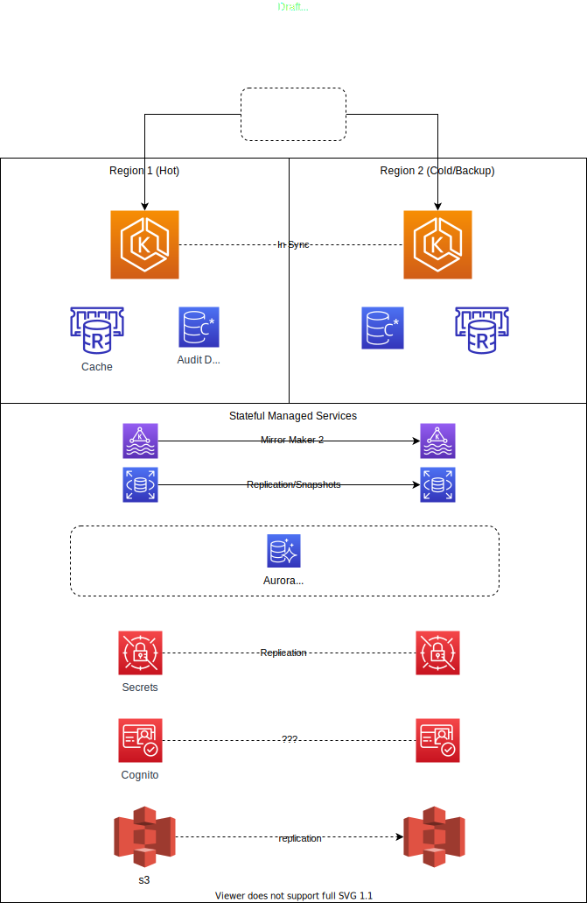

# Core Infrastructure Diagram

- Current State, shared services built, scratch-dev, qa and uat mostly automated via terraform
- In progress, implementing complete automation end to end of an environment
- Deployment of micro-service workloads , done

----------

# Environment Networking

- Current State: Simple networking between environments using transit gateway. Reviews on design for multitenancy
- Decisions required about connecting to third party services. Private Link, VPN, shared VPNs, compliance requirements.

----------

# Shared Services

- Current State: Deployed , but work in progress
- In a prodcution environment shared services would be a minimal install to facilitate maintnence and updates

----------
# Application Services

- Current State: Deployed , functional but work in progress, will evolve with requirements

----------

# API Gateway Detail

---------
# Software lifecycle management

- Current State: Core functionality worked out and in use. Release process, environment progression to be fleshed out
- Partially Complete. API Gateway lifecycle management

----------

# Draft proposal simple across region HA.

- Hot cold deployment
- DNS switchover
- Multiple EKS clusters keep in sync via automation/gitops. 
- Data syncronised from hot to cold

----------

# TO DO / To Decide on

- Single Region Disaster Recover / Partially completed ( EKS backup done ) managed services to do
- Across region failover ( intital design but AWS help would be great )
- Compliance. Hardening, assistance with compliance requirements and how we can achieve that. What AWS services can get us there?
- Threat Management, NIDs, HIDs, Use of Guard Duty
- ~~Multitenancy design, where is boundary: account, vpc, EKS Cluster, nodes/subnets etc, shared databases, AuroraDB ?~~
- How to do Cognito across region HA ?
- We would like to use AWS private link where possible, does this make sense, complexity is lower and failover is easier if we go across the public internet?
- Effective use of NAT Gateways / Single egress VPC for multiple clients?
- Smaller Primary CIDR ranges for EKS. https://aws.amazon.com/about-aws/whats-new/2018/10/amazon-eks-now-supports-additional-vpc-cidr-blocks/
- Helm Chart GPG Signing as part of the release process - Supply Chain Integrity
- Falco for threat detection
- Kubebench for EKS compliance
- Image Signing with SigStore as part of the release process - Supply Chain Integrity
- Hardened nodes with bottle rocket
- OpenPolicy Agent Gateway
- Hardened Istio Rules around egress
